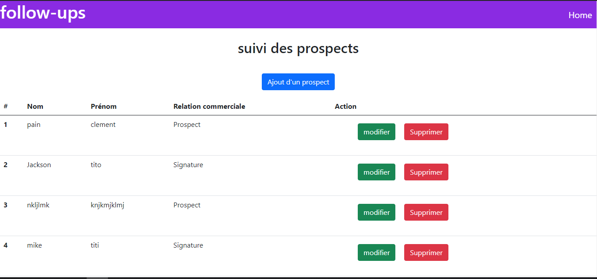

# test_upswing_engineering

## intro
This project is a customer follow-up, with the possibility to add, delete or modify a customer.

## React / Express / MongoDB
I created a `run.sh` script that runs the project directly.

If you want to run it manually: 

Start backend : `cd backend`+`npm install` +`node initDbs`+ `nodemon index`

Start frontend: `cd frontend` + `npm start`

_____________________________

## Todo
-log out button
-comment to translate in english
-delete and update directly on the homepage
-try to make a more elaborate design

  
💻 Made by Mosindo